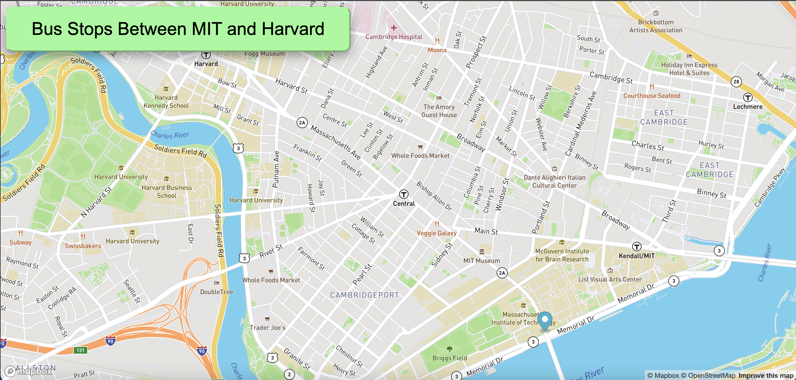

# RealTimeBusTracker
Title: Real Time Bus Tracker
Uploaded: 10-20-21.

This project displays a map of Boston and shows every bus stop between MIT and Harvard.
A loop is used to mark each stop, in order from MIT and one at  a time, at an interval of 3 seconds.
I added style to the background and button.

How to run? Download all files from this repository into a single folder then drag and drop the html file
into your browser of choice.

In the future I plan to add aditional bus routes from MIT and a darkmode for the map.

License Info: I do not own rights to this program. Most of this program is coded and distributed according to MIT license.
If you use this code in any projects please inculde MIT and MapBox and/or contact them for additional licensing information.

